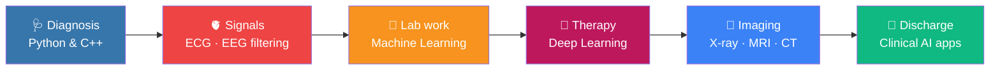

<div align="center">


<a href="https://github.com/ahmedselim0">
  
</a>


</div>

---

## 📋 Patient File

<table>
<tr><td><b>🧑‍⚕️ Name</b></td><td>Ahmed Selim</td></tr>
<tr><td><b>🏥 Department</b></td><td>Biomedical Engineering (student)</td></tr>
<tr><td><b>🩺 Chief complaint</b></td><td>Can't stop thinking about machine learning, biosignals and Python</td></tr>
<tr><td><b>🔬 Diagnosis</b></td><td>Chronic curiosity. Prognosis: excellent</td></tr>
<tr><td><b>💊 Current treatment</b></td><td>Building, learning, shipping</td></tr>
<tr><td><b>⚠️ Allergies</b></td><td>Bugs without stack traces</td></tr>
</table>

I bridge **healthcare technology** and **artificial intelligence**, using machine learning and software to solve biomedical problems, from physiological signals to medical data, and turning the results into usable Python apps.

---

## 🫀 Anatomy of My Interests

<div align="center">

</div>

---

## 📟 Vital Signs

<div align="center">

</div>

Here is the kind of thing I'm learning to build: an R-peak detector that estimates heart rate from a raw ECG *(illustrative snippet)*.

```python
import numpy as np
from scipy.signal import butter, filtfilt, find_peaks

def detect_r_peaks(ecg, fs=360):
    b, a = butter(3, [0.5, 40], btype="bandpass", fs=fs)      # remove drift & noise
    clean = filtfilt(b, a, ecg)
    peaks, _ = find_peaks(clean, distance=int(0.25 * fs),      # refractory period
                          height=1.5 * np.std(clean))
    heart_rate = 60 * fs / np.diff(peaks).mean()                # bpm
    return peaks, heart_rate
```


---

## 💊 Prescription (Tech Stack)

| ℞ | Category | Tools |
|:-:|---|---|
| 1 | **Core languages** |    |
| 2 | **Signal processing** |     |
| 3 | **Machine learning** |    |
| 4 | **Medical imaging** |  |
| 5 | **Apps & backend** |    |
| 6 | **Workflow** |    |

<sub>*Dosage: daily. Side effects may include excessive coding.*</sub>

---

## 🧪 Case Studies

### ✅ Completed: [SelimTours](https://github.com/ahmedselim0/selim_tours)
Full-stack travel booking platform.
**Frontend:** HTML · CSS · JavaScript &nbsp;|&nbsp; **Backend:** Node.js · Express · SQLite · JWT auth · rate limiting · email notifications
**Features:** trip catalogue, bookings, reviews, wishlist, user dashboard and admin panel

### 🧫 Upcoming Clinical Trials

| Trial | Objective | Stack | Phase |
|---|---|---|---|
| 🫀 **ECG Arrhythmia Classifier** | Detect abnormal heartbeats from ECG | SciPy · scikit-learn |  |
| 🧠 **EEG Signal Explorer** | Filter, visualise and extract features from EEG | MNE · Streamlit |  |
| 🩻 **Chest X-ray Classifier** | CNN for pneumonia detection | PyTorch · OpenCV |  |

---

## 🧠 From Neurons to Neural Networks

<div align="center">

</div>

## 🗺 Treatment Plan



---

## 🔬 Lab Results

<div align="center">


<picture>
  <source media="(prefers-color-scheme: dark)" srcset="https://raw.githubusercontent.com/ahmedselim0/ahmedselim0/output/snake-dark.svg"/>
  
</picture>

</div>

---

## 📞 Book an Appointment

<div align="center">

[](mailto:YOUR_EMAIL_HERE)
[](https://linkedin.com/in/YOUR_LINKEDIN)
[](https://github.com/ahmedselim0)

*"The best way to predict the future of medicine is to engineer it."*


</div>
